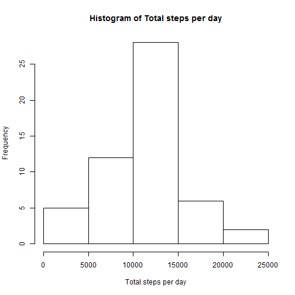
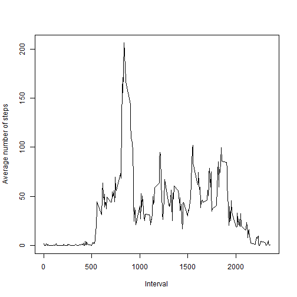
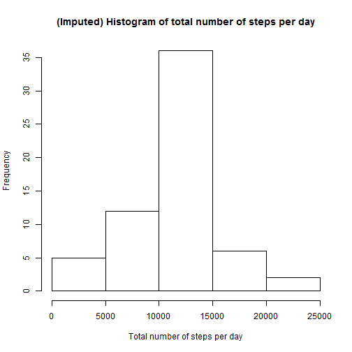
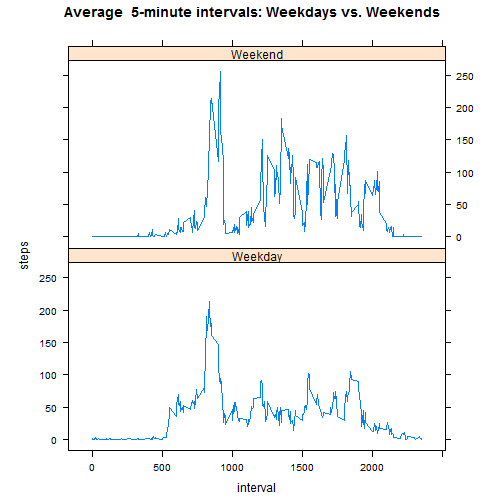

# Data Science Specialization
## Reproducible Research: Peer Assessment 1

### Loading and preprocessing the data
Loading the data

```r
raw_data <- read.csv("activity.csv", stringsAsFactors = F)
# ommit missing values
activity.data <- na.omit(raw_data)
```

### Mean total number of steps taken per day
Histogram of the total number of steps taken each day

```r
# Total number of steps taken per day
steps_per_day <- tapply(activity.data$steps, activity.data$date, sum)
head(steps_per_day)
```

```
## 2012-10-02 2012-10-03 2012-10-04 2012-10-05 2012-10-06 2012-10-07 
##        126      11352      12116      13294      15420      11015
```

```r
# Histogram of the total number of steps taken each day
hist(steps_per_day, xlab="Total steps per day", main="Histogram of Total steps per day")
```

 

```r
# Mean total number of steps per day
mean(steps_per_day)
```

```
## [1] 10766.19
```

```r
# Median total number of steps per day
median(steps_per_day)
```

```
## [1] 10765
```

### Average daily activity pattern

Time series plot of the 5-minute interval (x-axis) and the average number of steps taken, averaged across all days

```r
steps_by_interval <- unlist(tapply(activity.data$step, activity.data$interval, mean, simplify=F))
plot(x=names(steps_by_interval), y=steps_by_interval, type="l", xlab="Interval", ylab="Average number of steps")
```

 

5-minute interval, on average across all the days in the dataset, with the maximum number of steps

```r
names(steps_by_interval)[steps_by_interval == max(steps_by_interval)]
```

```
## [1] "835"
```

### Imputing missing values
Total number of missing values in the dataset (i.e. the total number of rows with NAs)

```r
sum(is.na(raw_data$steps))
```

```
## [1] 2304
```
My strategy for filling in all of the missing values in the dataset is to replace them with the mean of 5-minute interval

```r
fill_in_data <- raw_data
fill_in_data$steps <- unlist(apply(raw_data, 1, 
  function(row) 
    if(is.na(row[1]))
       as.numeric(as.vector(steps_by_interval[sub(" +", "", as.vector(row)[3])]))
    else as.numeric(as.vector(row)[1])))
steps_per_day <- tapply(fill_in_data$step, fill_in_data$date, sum)
```

Histogram of the total number of (imputed) steps taken per day 

```r
hist(steps_per_day, xlab="Total number of steps per day",
     main="(Imputed) Histogram of total number of steps per day")
```

 

```r
# Mean total number of steps per day
mean(steps_per_day)
```

```
## [1] 10766.19
```

```r
# Median total number of steps per day
median(steps_per_day)
```

```
## [1] 10766.19
```


#### Do these values differ from the estimates from the first part of the assignment? 
The mean has not changed as we have filled the missing data with the mean of the 5-minute interval.

The median have changed cause we have varied the values.


#### What is the impact of imputing missing data on the estimates of the total daily number of steps?

As we have added steps values where previously there were none the number of steps have increaded.


### Differences in activity patterns between weekdays and weekends
Factor variable in the dataset with two levels - "weekday" and "weekend"

```r
fill_in_data$day <- factor(ifelse(as.POSIXlt(as.Date(fill_in_data$date))$wday >5, "Weekend", "Weekday"))
```

Panel plot containing a time series plot of the 5-minute interval (x-axis) and the
average number of steps taken, averaged across all weekday days or weekend days (y-axis). 

```r
fill_in_data2 = aggregate(steps ~ interval + day, fill_in_data, mean)
library(lattice)
xyplot(steps ~ interval | day, data = fill_in_data2, aspect = 1/2, 
       type = "l", main="Average  5-minute intervals: Weekdays vs. Weekends")
```

 
